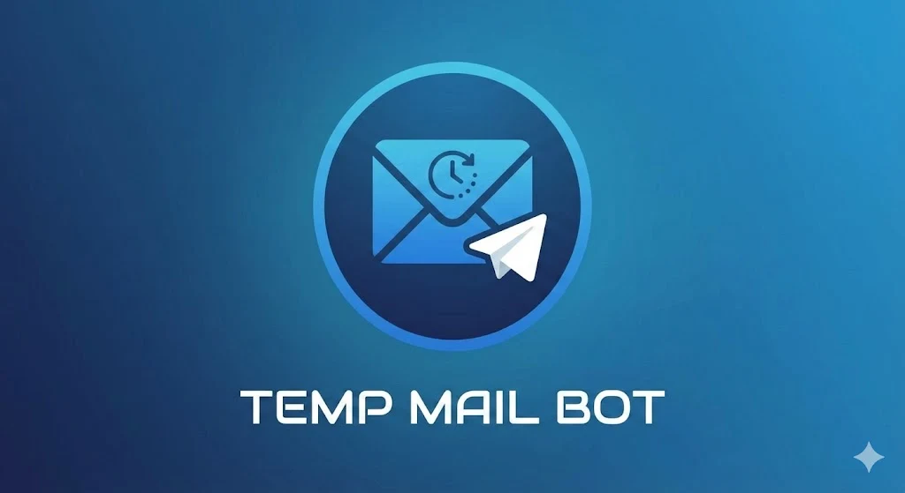

# 📧 [Telegram Temp Mail Bot](https://t.me/temp_mailtbot)


<p align="center">
  
</p>


👉 **[Start the Bot on Telegram](https://t.me/temp_mailtbot)**

> **Fast, Secure, and Professional Disposable Email Service directly on Telegram.**

---

## 📖 Table of Contents
- [✨ Features](#-features)
- [🛠️ How It Works](#️-how-it-works)
- [📋 System Requirements](#-system-requirements)
- [⚙️ Configuration](#️-configuration)
- [🚀 Setup & Deployment](#-setup--deployment)
- [🌐 Hosting on VPS](#-hosting-on-vps)
- [🤝 Support](#-support)

---

## ✨ Features
*   🚀 **Instant Generation**: Get a new email address in one click.
*   🔄 **Live Inbox**: Refresh to receive OTPs and messages in real-time.
*   📱 **User-Friendly**: Monospaced emails for easy "Tap-to-Copy".
*   🔒 **Secure**: Private sessions and automatic cleanup.
*   👮 **Admin Panel**: Broadcast messages and manage bot settings.

---

## 🛠️ How It Works
1.  **Subscription Check**: Ensures users are part of your community before granting access.
2.  **Mail Assignment**: Creates a temporary account using the `mailjs` engine.
3.  **Persistence**: Saves your session in MongoDB so your email stays active until you delete it.
4.  **Content Extraction**: Cleans HTML emails and extracts important links for easy viewing on Telegram.

---

## 📋 System Requirements
| Requirement | Minimum Version |
| :--- | :--- |
| **Node.js** | `v18.x.x` or higher |
| **NPM** | `v9.x.x` or higher |
| **Database** | `MongoDB v5.0+` (Local or Atlas) |
| **OS** | Linux (Recommended), Windows, or macOS |

---

## ⚙️ Configuration
Create a `.env` file in the root directory. Use the following validation rules to ensure the bot runs without errors:

| Variable | Description | Example / Validation |
| :--- | :--- | :--- |
| `BOT_TOKEN` | API Token from [@BotFather](https://t.me/BotFather) | `123456:ABC-DEF...` |
| `MONGO_URI` | Your MongoDB connection string | `mongodb+srv://.../` |
| `CHANNEL_ID` | Numeric ID of the required channel | `-100123456789` (Must be numeric) |
| `CHANNEL_LINK` | Public username of the channel | `@YourChannel` (Must include `@`) |
| `ADMIN_ID` | Your numeric Telegram ID | `123456789` (Must be numeric) |

---

## 🚀 Setup & Deployment

### 1️⃣ Clone the Repository
```bash
git clone <your-repo-url>
cd temp-mail
```

### 2️⃣ Install Dependencies
```bash
# Installs core libraries: telegraf, mongoose, mailjs, and dotenv
npm install
```

### 3️⃣ Local Execution
```bash
# Start the bot in development mode
node index.js
```

---

## 🌐 Hosting on VPS (Production)

For a stable **24/7 online** status, use **PM2** (Process Manager 2).

### 🛠️ Step 1: Install Node.js & PM2
```bash
# Ubuntu/Debian example
curl -fsSL https://deb.nodesource.com/setup_18.x | sudo -E bash -
sudo apt-get install -y nodejs
sudo npm install -g pm2
```

### ⚙️ Step 2: Environment Setup
```bash
nano .env  # Paste your validated variables here
```

### 🚀 Step 3: Launch with Auto-Restart
```bash
# Start the process
pm2 start index.js --name "mail-bot"

# Enable auto-restart on server reboot
pm2 startup
pm2 save
```

### 📊 Step 4: Monitoring
*   `pm2 status`: Check if the bot is online.
*   `pm2 logs mail-bot`: View real-time error logs.
*   `pm2 restart mail-bot`: Apply changes after updating `.env`.

---

## 🤝 Support
📢 **Join Channel**: [@sk_genz](https://t.me/sk_genz)  
👨‍💻 **Developer**: Use the **"Meet Developer"** button inside the bot for direct support or custom bot development.

---
*Built with ❤️ using Telegraf and Node.js*
